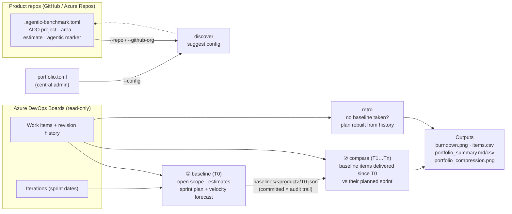
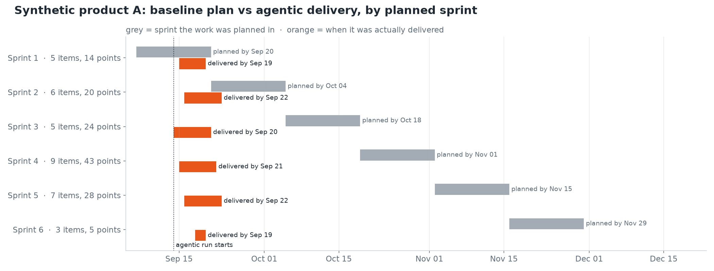
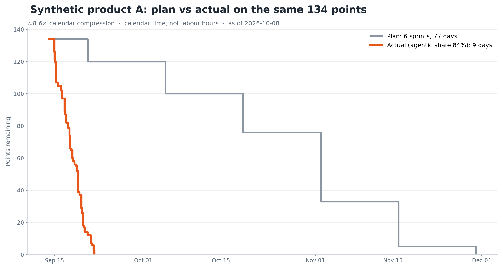

# agentic-benchmark

**How much faster did agentic delivery land than the plan said it would?**

`agentic-benchmark` freezes a product's current plan from Azure DevOps (the team's own estimates, sprints and velocity). Later, once agents have done the work, it measures the same scope against that plan. The answer is a calendar **×-speed** per product and across the portfolio, with the raw rows behind every number.

It is built for two kinds of user:

- **Product teams** add one config file to their repo and run it themselves.
- **A central admin engineer** runs it across every repo they can access (GitHub or Azure Repos) from one place, or on a schedule with GitHub Actions.

> **New here? Start with [docs/GETTING_STARTED.md](docs/GETTING_STARTED.md).** It has a 5-minute demo that needs no Azure DevOps access, step-by-step paths for a product team and for a central admin, sample output, and troubleshooting.



## The workflow

| When | Command | What you get |
|---|---|---|
| Onboarding a team | `discover` | The team's work item types, states, which estimate field is filled, area paths and any agent tags, plus a ready-to-paste config |
| **Before** the agentic SDLC starts (T0) | `baseline` | A frozen plan: open scope, estimates, planned sprint per item (team-assigned, or forecast at historical velocity), and the plan's end date |
| Any time **after** (T1…Tn) | `compare` | For baseline items delivered since T0: planned days vs actual days = **×-speed**, the agentic share of the delivered work, and a projection for the full baseline scope at the current pace |
| No baseline was taken | `retro` | The original plan rebuilt from revision history (the first sprint each item was given). This is the less robust method; use `baseline` whenever you can |

## Features and measures at a glance

**Commands**

| Feature | What it does |
|---|---|
| `discover` | Inspects an ADO project or area: types, states, which estimate field is filled, area paths, tags. Prints a ready-to-paste config |
| `baseline` | Freezes the current plan into `baselines/<product>/<date>.json`: open scope, estimates, team-assigned sprints, and a velocity forecast for unscheduled items |
| `compare` | Measures baseline scope delivered since the baseline against when that baseline planned it, with a weekly trend rebuilt from ADO history |
| `retro` | Rebuilds the original plan from revision history when no baseline was taken |

**Setup and robustness**

| Feature | What it does |
|---|---|
| Multi-product | One central `portfolio.toml`, `.agentic-benchmark.toml` files read from GitHub repos (`--repo`, `--github-org`), or CSV exports from other trackers |
| Estimation styles | Story points, effort, size, hours (`OriginalEstimate`), or item count for teams that don't estimate. Missing estimates are excluded or filled with the team median |
| Process templates | Scrum, Agile, CMMI and Basic |
| Access | Read-only. Uses `az login` (SSO) or an `ADO_PAT` / `ADO_TOKEN` (`transport = "auto"` picks) |
| Robust enterprise runs | A product with no baseline or an error is listed with its status and never stops the run |
| Data guards | Items re-sprinted after they were done keep their original plan. Backfilled items (created already done), scope added after the baseline, and removed items are reported, never compared |

**Reporting**

| Feature | What it does |
|---|---|
| Report | `out/report.html`, self-contained, with a **View** selector: Enterprise overview plus every product, grouped by business unit |
| Automation | GitHub Action runs `compare` daily in imported copies. `baseline` runs open a pull request for review |
| Claude Code skill | `skills/agentic-benchmark/SKILL.md` guides teams through setup, baseline, compare and write-up |

**Measures per product**

| Measure | Definition |
|---|---|
| **×-speed** (calendar compression) | planned calendar days ÷ actual calendar days, for the same delivered baseline scope |
| Planned window / actual window | baseline (or run start) → latest planned sprint end of the delivered items / → last delivery |
| % of baseline delivered | delivered baseline estimate ÷ total baseline estimate |
| Agentic share | share of delivered estimate matching `agentic_rule` (tag, area path or field) |
| **Projected ×-speed** and projected end | full baseline scope at the pace so far, measured over active time: up to as-of, or up to the last build if the product is paused |
| Weeks vs plan (projected) | baseline end date − projected end date |
| Sprint table | per planned sprint: planned done-by, actually done-by, days early, agentic share |
| Trend | the measures above, week by week since the baseline |
| **Pause diagnostic** | no build (delivery of any in-scope item) for more than `pause_after_days` (default 14) while baseline work remains: the product is marked *paused since <date>*, its clock stops at the last build, and the idle tail is not measured |

**Measures for the enterprise** (one vote per product, only unit-free measures, never summed points)

| Measure | Definition |
|---|---|
| Adoption funnel | onboarded → baseline frozen → delivering → ≥ 50% of baseline delivered, with the number of paused products |
| Median ×-speed and spread | median across delivering products, with the middle half (≥ 4 products) or the range |
| Median % delivered, median agentic share, median projected ×, median weeks vs plan | the medians across products |
| Business-unit rollup | all of the above per `group` |
| Enterprise trend | per week, the median of each product's latest reading, with the number of products reporting |

What's new in each version: [RELEASE_NOTES.md](RELEASE_NOTES.md). Working on the code: [CLAUDE.md](CLAUDE.md).

## Install

Requirements:
- Python 3.11 or later.
- **Either** the Azure CLI (`az extension add -n azure-devops`, then `az login`) **or** an `ADO_PAT` with *Work Items: Read*.
- For `--repo` / `--github-org`, the GitHub CLI (`gh auth login`).

```bash
# use the tool from your own product repo
pip install "git+https://github.com/jintomjose/agentic-benchmarks.git"

# or work on the tool itself
git clone https://github.com/jintomjose/agentic-benchmarks.git && cd agentic-benchmarks
python3 -m venv .venv && source .venv/bin/activate      # Windows: .venv\Scripts\Activate.ps1
pip install -e ".[test]" && pytest -q
agentic-benchmark retro --config examples/portfolio.toml --out out/demo   # offline demo
```

## Quick start: one team

Run these from your product repo. The full walkthrough is in [GETTING_STARTED.md, section B](docs/GETTING_STARTED.md#b-product-team-measure-your-own-product).

```bash
# 1. Inspect your ADO project; paste the suggested config into .agentic-benchmark.toml
agentic-benchmark discover --org https://dev.azure.com/<org> --project <project> --area-path "<project>\<team>"

# 2. Before agents start: freeze the plan, then commit baselines/<product>/<date>.json
agentic-benchmark baseline --config .agentic-benchmark.toml

# 3. Any time later: measure
agentic-benchmark compare --config .agentic-benchmark.toml
```

## Quick start: central admin across many repos

The full walkthrough, including GitHub Actions setup, is in [GETTING_STARTED.md, section C](docs/GETTING_STARTED.md#c-central-admin-many-products).

```bash
agentic-benchmark discover --repo my-org/mortgage-app          # check one team's config against ADO
agentic-benchmark baseline --github-org my-org                 # every repo carrying .agentic-benchmark.toml
agentic-benchmark compare  --github-org my-org --out out/2026-12
agentic-benchmark compare  --config portfolio.toml             # or one central file (see examples/portfolio.toml)
```

`.github/workflows/benchmark.yml` runs `compare` every day at 06:00 UTC once you've set the secrets `ADO_PAT` and `CONFIG_READ_TOKEN` and the variable `PRODUCT_GITHUB_ORG`. Running `baseline` on demand opens a pull request with the new baselines. Forks keep scheduled workflows off until you enable them in the Actions tab, and the upstream repo skips scheduled runs on purpose. For products in Azure Repos, list them in a central `portfolio.toml`.

## Configuration

Settings go in a team repo's `.agentic-benchmark.toml` (one `[product]` block) or in a central file (`[defaults]` plus `[[product]]` blocks). Every key is optional except `org` and `project`.

| Key | Meaning | Default |
|---|---|---|
| `org`, `project`, `area_path` | Where the backlog lives; `area_path` narrows a shared project down to one team | – |
| `transport` | `auto` (REST if `ADO_PAT`/`ADO_TOKEN` is set, else the `az` CLI), `az`, or `rest` | `auto` |
| `work_item_types` | What counts as scope (covers the Scrum, Agile, CMMI and Basic templates) | PBI, User Story, Requirement, Issue, Bug |
| `estimate` | `points`, `hours` (OriginalEstimate) or `count` (teams that don't estimate) | `points` |
| `points_field` | `auto`, or the StoryPoints / Effort / Size reference name | `auto` |
| `unestimated` | `exclude` (with a warning) or `median` (fill gaps with the team median) | `exclude` |
| `done_states`, `removed_states` | The process's terminal states | Done, Closed, Resolved, Completed / Removed, Cut |
| `agentic_rule` | `{type="tag", value="Agentic"}`, `{type="area_path", value="Proj\\Agentic"}` or `{type="field", field="Custom.BuildMode", value="Agent"}` | tag `Agentic` |
| `velocity`, `velocity_sprints` | `auto` = average of the last N finished sprints, or a fixed number | `auto`, 3 |
| `run_start` | Day the agentic SDLC started; picks the baseline and starts both clocks | – |
| `baseline` | Pin a specific baseline file | latest baseline on or before `run_start`, else the earliest |
| `pause_after_days` | No build for longer than this = paused; the clock stops at the last build | 14 |
| `group` | Business unit or domain, used for the enterprise rollup and to group products in the report's selector | – |
| `include_titles` | Set to `false` to drop work item titles from the outputs | `true` |
| `timezone` | Used to turn timestamps into calendar days | Europe/Amsterdam |
| `source = "csv"`, `csv_path` | Non-ADO trackers (`retro` only); see `examples/*.csv` | – |

## Reporting out

Every `compare` and `retro` run writes **`out/report.html`**: one self-contained file, with images embedded, that you can email, attach or publish as is. A **View** selector at the top switches between the enterprise overview and each product, grouped by business unit. Each view has its own link (`report.html#<product>`).

1. **Enterprise overview**, for senior management:
   - A summary sentence
   - An adoption funnel: onboarded → baselined → delivering → ≥ 50% delivered
   - Medians across products: ×-speed, % of baseline delivered, agentic share, projected weeks against plan
   - A weekly trend
   - A rollup by business unit (`group` in config)
   - A clickable table of all products, with a status for each
2. **Per product:**
   - Headline figures
   - The **baseline vs agentic timeline**: each planned sprint's window against when its scope was actually delivered
   - A sprint-by-sprint table (planned done-by, actually done-by, days early, agentic share)
   - The burndown on the same scope
   - Every exclusion and warning
3. **How to read this:** the caveats, always included.

The same enterprise numbers are written to `out/enterprise_summary.json` for dashboards. Points are never added up across teams: every product counts once and only unit-free measures are rolled up (see [METHOD.md](docs/METHOD.md#enterprise-rollup)).

| Baseline vs agentic timeline | Plan vs actual burndown |
|---|---|
|  |  |

*(Synthetic demo data from `examples/`.)*

## All outputs

```
baselines/<product>/<date>.json          frozen plan (commit it)
out/report.html                          the shareable report (enterprise overview + every product)
out/enterprise_summary.json              enterprise rollup, by business unit and weekly trend
out/portfolio_summary.md|csv             one row per product (for decks and spreadsheets)
out/portfolio_compression.png            ×-speed by product
out/<product>/baseline_plan.png          the plan as a burndown
out/<product>/compare_timeline.png       baseline vs agentic timeline, by planned sprint
out/<product>/compare_burndown.png       plan vs actual on the same scope
out/<product>/compare_trend.png          ×-speed and % delivered week by week
out/<product>/compare_items.csv          every row behind the numbers, with notes on exclusions
out/cache/                               raw ADO revisions: includes names, keep local (git-ignored)
```

No assignees, emails or other personal data are written to the outputs. Titles can be switched off (`include_titles = false`).

**About "effort":** the comparison is estimated scope (points, hours or item count) against calendar time. It does not measure the labour hours spent by people or agents.

## Before you quote a number

Read [docs/METHOD.md](docs/METHOD.md). The short version:

- It compares a **plan with actual delivery**. It is not a controlled human-versus-agent experiment.
- **×-speed is calendar time, not labour hours.**
- Compare products by **×-speed, never by points**.
- **Agentic share** is only as good as the team's tagging discipline.

## Use with Claude Code

`skills/agentic-benchmark/SKILL.md` is a Claude Code skill. It walks a team through `discover`, config, `baseline` and `compare`, and writes up the result with the caveats. Copy it to `.claude/skills/` in a product repo or in `~/.claude/skills/`.

## Roadmap

- Evidence from the repos themselves: count work items as agentic when they're linked to pull requests by the agent identity or to commits with an agent `Co-Authored-By` trailer, rather than relying on tags alone.
- Read `.agentic-benchmark.toml` directly from Azure Repos.
- Quality guardrails alongside speed: escaped defects, change failure rate and rework per product.
