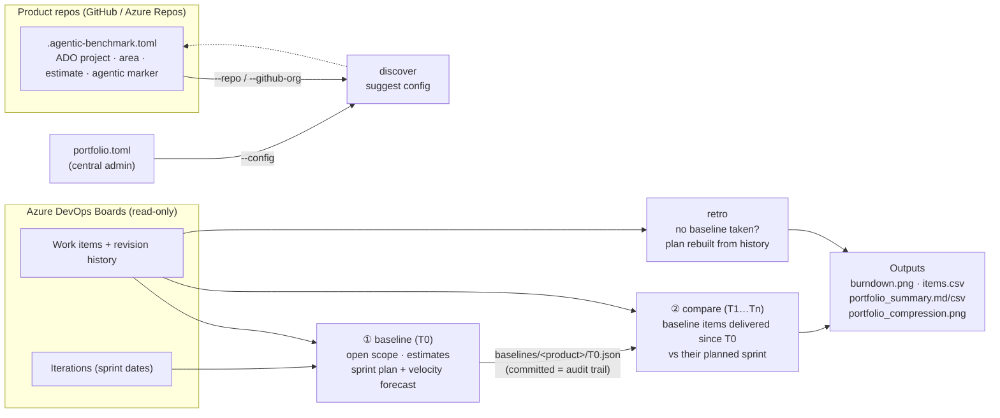

# agentic-benchmark

**How much faster did agentic delivery land than the plan said it would?**

`agentic-benchmark` freezes a product's current plan from Azure DevOps (the team's own estimates, sprints and velocity). Later, once agents have done the work, it measures the same scope against that plan. The answer is a calendar **×-speed** per product and across the portfolio, with the raw rows behind every number.

It is built for two kinds of user:

- **Product teams** add one config file to their repo and run it themselves.
- **A central admin engineer** runs it across every repo they can access (GitHub or Azure Repos) from one place, or on a schedule with GitHub Actions.

> **New here? Start with [docs/GETTING_STARTED.md](docs/GETTING_STARTED.md).** It has a 5-minute demo that needs no Azure DevOps access, step-by-step paths for a product team and for a central admin, sample output, and troubleshooting.



## The workflow

| When | Command | What you get |
|---|---|---|
| Onboarding a team | `discover` | The team's work item types, states, which estimate field is filled, area paths and any agent tags, plus a ready-to-paste config |
| **Before** the agentic SDLC starts (T0) | `baseline` | A frozen plan: open scope, estimates, planned sprint per item (team-assigned, or forecast at historical velocity), and the plan's end date |
| Any time **after** (T1…Tn) | `compare` | For baseline items delivered since T0: planned days vs actual days = **×-speed**, the agentic share of the delivered work, and a projection for the full baseline scope at the current pace |
| No baseline was taken | `retro` | The original plan rebuilt from revision history (the first sprint each item was given). This is the less robust method; use `baseline` whenever you can |

## Install

Requirements:
- Python 3.11 or later.
- **Either** the Azure CLI (`az extension add -n azure-devops`, then `az login`) **or** an `ADO_PAT` with *Work Items: Read*.
- For `--repo` / `--github-org`, the GitHub CLI (`gh auth login`).

```bash
# use the tool from your own product repo
pip install "git+https://github.com/jintomjose/agentic-benchmarks.git"

# or work on the tool itself
git clone https://github.com/jintomjose/agentic-benchmarks.git && cd agentic-benchmarks
python3 -m venv .venv && source .venv/bin/activate      # Windows: .venv\Scripts\Activate.ps1
pip install -e ".[test]" && pytest -q
agentic-benchmark retro --config examples/portfolio.toml --out out/demo   # offline demo
```

## Quick start: one team

Run these from your product repo. The full walkthrough is in [GETTING_STARTED.md, section B](docs/GETTING_STARTED.md#b-product-team-measure-your-own-product).

```bash
# 1. Inspect your ADO project; paste the suggested config into .agentic-benchmark.toml
agentic-benchmark discover --org https://dev.azure.com/<org> --project <project> --area-path "<project>\<team>"

# 2. Before agents start: freeze the plan, then commit baselines/<product>/<date>.json
agentic-benchmark baseline --config .agentic-benchmark.toml

# 3. Any time later: measure
agentic-benchmark compare --config .agentic-benchmark.toml
```

## Quick start: central admin across many repos

The full walkthrough, including GitHub Actions setup, is in [GETTING_STARTED.md, section C](docs/GETTING_STARTED.md#c-central-admin-many-products).

```bash
agentic-benchmark discover --repo my-org/mortgage-app          # check one team's config against ADO
agentic-benchmark baseline --github-org my-org                 # every repo carrying .agentic-benchmark.toml
agentic-benchmark compare  --github-org my-org --out out/2026-12
agentic-benchmark compare  --config portfolio.toml             # or one central file (see examples/portfolio.toml)
```

`.github/workflows/benchmark.yml` runs `compare` every day at 06:00 UTC once you've set the secrets `ADO_PAT` and `CONFIG_READ_TOKEN` and the variable `PRODUCT_GITHUB_ORG`. Running `baseline` on demand opens a pull request with the new baselines. Forks keep scheduled workflows off until you enable them in the Actions tab, and the upstream repo skips scheduled runs on purpose. For products in Azure Repos, list them in a central `portfolio.toml`.

## Configuration

Settings go in a team repo's `.agentic-benchmark.toml` (one `[product]` block) or in a central file (`[defaults]` plus `[[product]]` blocks). Every key is optional except `org` and `project`.

| Key | Meaning | Default |
|---|---|---|
| `org`, `project`, `area_path` | Where the backlog lives; `area_path` narrows a shared project down to one team | – |
| `transport` | `auto` (REST if `ADO_PAT`/`ADO_TOKEN` is set, else the `az` CLI), `az`, or `rest` | `auto` |
| `work_item_types` | What counts as scope (covers the Scrum, Agile, CMMI and Basic templates) | PBI, User Story, Requirement, Issue, Bug |
| `estimate` | `points`, `hours` (OriginalEstimate) or `count` (teams that don't estimate) | `points` |
| `points_field` | `auto`, or the StoryPoints / Effort / Size reference name | `auto` |
| `unestimated` | `exclude` (with a warning) or `median` (fill gaps with the team median) | `exclude` |
| `done_states`, `removed_states` | The process's terminal states | Done, Closed, Resolved, Completed / Removed, Cut |
| `agentic_rule` | `{type="tag", value="Agentic"}`, `{type="area_path", value="Proj\\Agentic"}` or `{type="field", field="Custom.BuildMode", value="Agent"}` | tag `Agentic` |
| `velocity`, `velocity_sprints` | `auto` = average of the last N finished sprints, or a fixed number | `auto`, 3 |
| `run_start` | Day the agentic SDLC started; picks the baseline and starts both clocks | – |
| `baseline` | Pin a specific baseline file | latest baseline on or before `run_start`, else the earliest |
| `include_titles` | Set to `false` to drop work item titles from the outputs | `true` |
| `timezone` | Used to turn timestamps into calendar days | Europe/Amsterdam |
| `source = "csv"`, `csv_path` | Non-ADO trackers (`retro` only); see `examples/*.csv` | – |

## Outputs

```
baselines/<product>/<date>.json          frozen plan (commit it)
out/<product>/baseline_plan.png          the plan as a burndown
out/<product>/compare_burndown.png       plan vs actual on the same scope
out/<product>/compare_items.csv          every row behind the chart, with notes on exclusions
out/portfolio_summary.md|csv             one row per product
out/portfolio_compression.png            ×-speed by product
out/cache/                               raw ADO revisions: includes names, keep local (git-ignored)
```

No assignees, emails or other personal data are written to the outputs. Titles can be switched off.

## Before you quote a number

Read [docs/METHOD.md](docs/METHOD.md). The short version:

- It compares a **plan with actual delivery**. It is not a controlled human-versus-agent experiment.
- **×-speed is calendar time, not labour hours.**
- Compare products by **×-speed, never by points**.
- **Agentic share** is only as good as the team's tagging discipline.

## Use with Claude Code

`skills/agentic-benchmark/SKILL.md` is a Claude Code skill. It walks a team through `discover`, config, `baseline` and `compare`, and writes up the result with the caveats. Copy it to `.claude/skills/` in a product repo or in `~/.claude/skills/`.

## Roadmap

- Evidence from the repos themselves: count work items as agentic when they're linked to pull requests by the agent identity or to commits with an agent `Co-Authored-By` trailer, rather than relying on tags alone.
- Read `.agentic-benchmark.toml` directly from Azure Repos.
- Quality guardrails alongside speed: escaped defects, change failure rate and rework per product.
